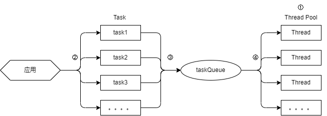
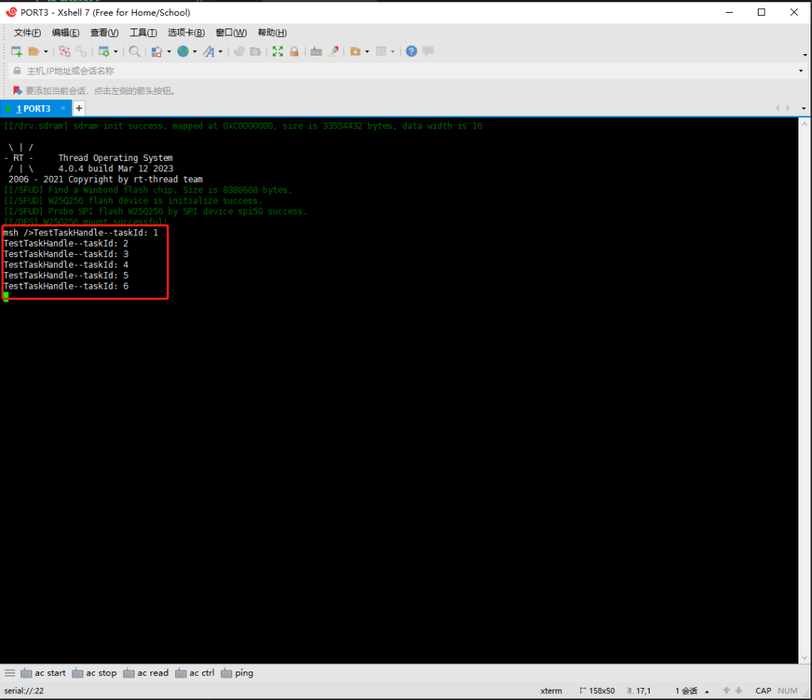
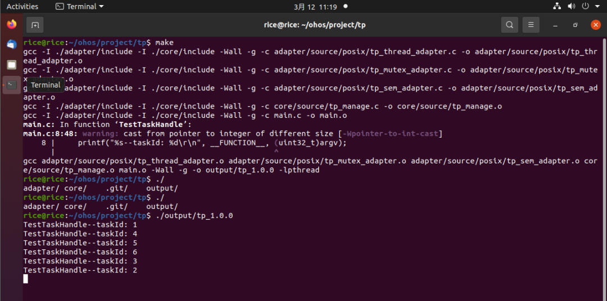

# RTP(Thread Pool)组件

RTP组件，又称线程池组件。是作者编写一个多线程管理组件，特点：

1. 跨平台：它支持任意的RTOS系统，Linux系统。
2. 易移植：该组件默认支持CMSIS和RTTHREAD接口，其他RTOS可以轻易适配兼容。
3. 接口简单：用户操作接口简单：创建线程池，增加task到线程池，销毁线程池，线程池所有线程挂起，线程池所有线程恢复，线程池的任务数。

## RTP原理



- ① 创建一个线程池，线程池中维护一个Task队列，用于Task任务；理论上：线程池中线程数目至少一个，最多无数个，但是我们要系统能力决定。
- ② 应用层根据业务需求，创建对应Task，Task数目不限制，根据系统资源创建。
- ③ 应用层创建的Task，会被挂在Task队列中。
- ④ 线程池的空闲线程，会检测Task队列中是否为空，如果Task队列不为空，则提取一个Task在线程中执行。

## 核心层实现

tp的提供的接口非常精简：创建线程池，增加任务到线程池，销毁线程池。

1. 创建线程池：

- 接口描述：rtp_err_t rtp_create(rtp *pool, const char *name, uint32_t stackSize, uint8_t threadNum);

| **参数**  | **说明**             |
| --------- | -------------------- |
| pool      | 线程池句柄           |
| name      | 线程池中线程名字     |
| stack_size | 线程池中线程的栈大小 |
| thead_num  | 线程池中线程数目     |
| **返回**  | --                   |
| RTP_EINVAL | pool无效参数         |
| RTP_ERROR  | 创建失败             |
| RTP_NOMEM  | 内存不足             |
| RTP_EOK    | 创建成功             |

- 接口实现：
  - ①创建task队列增删互斥量：管理task队列的增加及释放的互斥关系，保证增加和释放为同步策略。
  - ②创建task队列状态信号量：当task队列非空则释放信号量，线程池中的线程可以从task队列中获取task执行。
  - ③创建线程池中线程：根据threadNum参数，创建对应的线程数目。

2. 增加任务到线程池：

- 接口描述：rtp_err_t rtp_add_task(rtp *pool, task_handle handle, void *argv);

| **参数**  | **说明**             |
| --------- | -------------------- |
| pool      | 线程池句柄           |
| handle    | 线程池中线程名字     |
| argv      | 线程池中线程的栈大小 |
| **返回**  | --                   |
| RTP_EINVAL | pool无效参数         |
| RTP_NOMEM  | 内存不足             |
| RTP_EOK    | 增加task成功         |

- 接口实现：
  - ① 创建一个task句柄，并将注册task函数和函数的入参。
  - ② 获取task队列互斥量，避免增加队列成员时，在释放队列成员。
  - ③ 释放task信号量，通知线程池中的线程可以从task队列中获取task执行

3. 挂起线程池所有线程

- 接口描述：void rtp_suspend(rtp *pool);

| **参数**  | **说明**     |
| --------- | ------------ |
| pool      | 线程池句柄   |
| **返回**  | --           |
| - | - |

- 接口实现：
  - ① 挂起线程池中所有线程。

4. 恢复线程池所有线程

- 接口描述：void rtp_resume(rtp *pool);

| **参数**  | **说明**     |
| --------- | ------------ |
| pool      | 线程池句柄   |
| **返回**  | --           |
| - | - |

- 接口实现：
  - ① 恢复线程池中所有线程。

5. 线程池的当前任务数

- 接口描述：rtp_err_t rtp_destroy(rtp *pool);

| **参数**  | **说明**     |
| --------- | ------------ |
| pool      | 线程池句柄   |
| **返回**  | --           |
| RTP_EINVAL | pool无效参数 |
| RTP_EOK    | 销毁成功     |

- 接口实现：
  - ① 删除线程池中所有线程。
  - ② 删除task队列互斥量，task状态信号量。
  - ③ 删除线程池的Task队列。

5. 线程池中线程函数

- 接口描述：static void rtp_handler(void *argv)

| **参数** | **说明**   |
| -------- | ---------- |
| argv     | 线程池参数 |

- 接口实现：
  - ① 获取task队列互斥量，避免增加队列成员时，在释放队列成员。
  - ② 当task队列为空时，将阻塞在获取信号量，等待用户增加task时释放信号量。
  - ③ 当task队列不为空，则从task队列中获取task，并执行。
  - ④ 当task执行完，会将对应的task句柄删除。

### TP应用

1. 测试例程：

- 创建一个线程池，线程池中包含3个线程，线程的名字为rtp，栈为1024byte。
- 在线程池中创建6个task，其中，task参数为taskId。

``` C
#include "RTP.h"

static rtp pool;

void TestRtpHandle(void *argv)
{
    printf("%s--taskId: %d\r\n", __FUNCTION__, (uint32_t)argv);
}

int main(void)
{
    // ①
    rtp_create(&pool, "rtp", 1024, 3);
    // ②
    rtp_add_task(&pool, TestRtpHandle, (void *)1);
    rtp_add_task(&pool, TestRtpHandle, (void *)2);
    rtp_add_task(&pool, TestRtpHandle, (void *)3);
    rtp_add_task(&pool, TestRtpHandle, (void *)4);
    rtp_add_task(&pool, TestRtpHandle, (void *)5);
    rtp_add_task(&pool, TestRtpHandle, (void *)6);

    return 0;
}
```

2. RTOS中的CMSIS运行效果：



3. Linux中POSIX接口运行效果：


